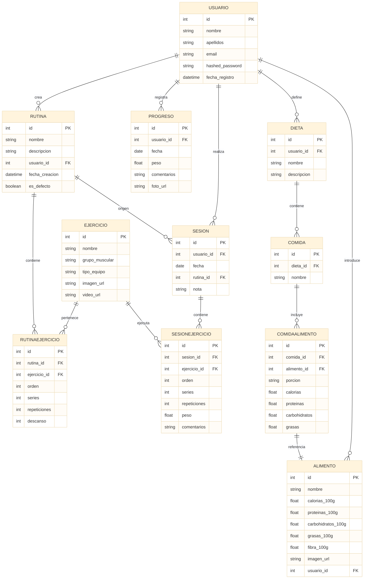

# 🏋️ Plataforma Web Fitness (TFC – Alejandro Santos)

Proyecto de fin de ciclo DAW: una aplicación web para la gestión personalizada de entrenamientos, dietas y progreso físico.

---

## 🧠 Tecnologías utilizadas

- **Frontend**: React.js + Tailwind CSS
- **Backend**: FastAPI + SQLModel + Uvicorn
- **Base de datos**: PostgreSQL (Docker)
- **Contenedores**: Docker & Docker Compose
- **Control de versiones**: Git + GitHub
- **Prototipos y diseño**: Figma
- **Despliegue**: Railway (backend) + Vercel (frontend)

---

## 📐 Estructura de base de datos

### Entidades principales

- `Usuario`
- `Ejercicio` (público o personalizado)
- `Rutina` → contiene ejercicios
- `Sesión` → entrenamiento real basado en rutina
- `Progreso` → registro físico del usuario (peso, fotos, notas)
- `Alimento` → consulta por Open Food Facts o manual
- `Dieta` → contiene comidas con alimentos personalizados

---

## 🔧 Funcionalidades implementadas

### 🧍‍♂️ Usuario
- Registro de usuario
- Login (pendiente de implementación con autenticación)
- Registro automático de fecha de alta

### 💪 Ejercicios
- Ver todos los ejercicios predefinidos
- Crear ejercicios personalizados por usuario
- Filtros por grupo muscular, equipo, tipo, etc.

### 🧩 Rutinas
- Crear rutinas con nombre y descripción
- Añadir ejercicios a la rutina con orden, series, repeticiones y descanso
- Ver rutinas propias y rutinas por defecto

### 🔁 Sesiones de entrenamiento
- Iniciar sesión desde rutina (copia ejercicios)
- Registrar peso, repeticiones, comentarios por ejercicio
- Guardar sesiones pasadas y ver historial

### 📈 Progreso físico
- Registrar peso corporal, comentarios y fotos
- Ver evolución semanal o mensual

### 🍽️ Consulta nutricional
- Buscar alimentos reales desde la API de Open Food Facts
- Mostrar nombre, marca, calorías, macros, imagen
- Insertar alimentos personalizados por el usuario

### 🥗 Dietas y comidas
- Crear dietas por usuario
- Añadir comidas a cada dieta
- Añadir alimentos a cada comida (porción, macros)
- Los alimentos pueden ser propios o buscados por API

### ✍️ Crear alimentos personalizados
- El usuario puede crear sus propios alimentos (ej: “batido casero postentreno”)
- Introduce manualmente los macros por 100g
- Estos alimentos se asocian solo a su cuenta (`usuario_id`)

---

## 📦 Estructura del proyecto

```bash
web-fitness/
├── web-fitness-front/     # React + Tailwind
├── web-fitness-back/      # FastAPI + SQLModel
│   ├── app/
│   │   ├── main.py
│   │   ├── models.py
│   │   ├── routes.py
│   │   └── db.py
│   ├── requirements.txt
│   └── docker-compose.yml
└── entregas/              # Informes, entregables
```

---

## 🧪 Cómo ejecutar el backend

```bash
cd web-fitness-back
python -m venv venv && source venv/bin/activate  # o .\venv\Scripts\activate en Windows
pip install -r requirements.txt
docker compose up -d  # levanta PostgreSQL
uvicorn app.main:app --reload  # arranca la API
```

---

## 📌 Diagrama entidad-relación



---
