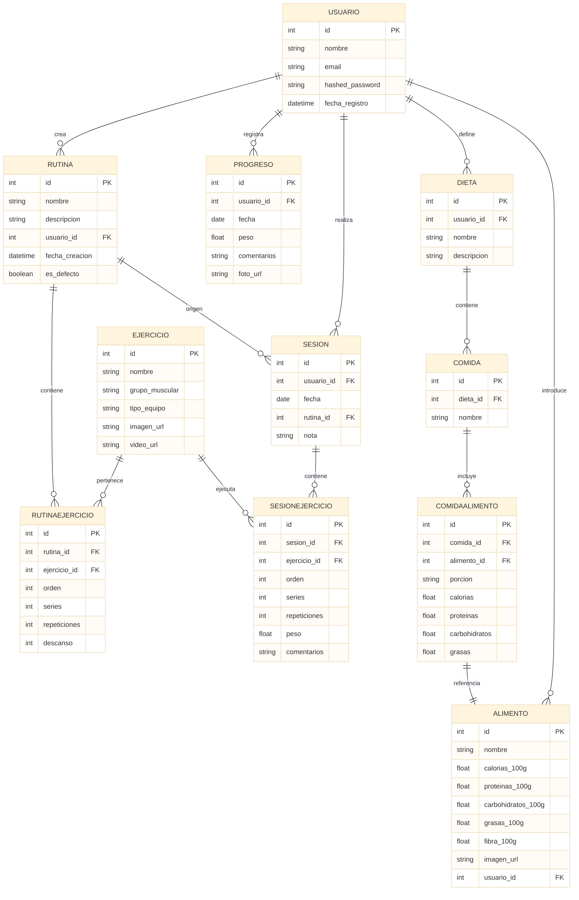

# Plataforma Web Fitness – TFC Alejandro Santos

## 🧠 Funcionalidades completas (versión final)

### 🏋️ Gestión de ejercicios
- Crear y consultar ejercicios filtrando por grupo muscular o equipo
- Añadir imágenes y vídeos demostrativos

### 🧠 Crear y gestionar rutinas
- Crear rutinas personales
- Añadir ejercicios con orden, series, repeticiones y descanso
- Consultar rutinas por defecto del sistema
- Copiar una rutina por defecto a tu cuenta

### 🔁 Iniciar rutina como sesión real
- Generar una sesión a partir de una rutina
- Registrar repeticiones reales, peso y comentarios

### 📈 Seguimiento de progreso físico
- Guardar peso, comentarios y fotos de evolución por fecha
- Consultar tu historial de progreso

### 🕒 Historial de sesiones
- Ver sesiones anteriores y los ejercicios realizados en cada una
- Usar esta información para valorar mejoras reales

### 🥗 Consulta nutricional (API Open Food Facts)
- Buscar alimentos reales de supermercados por nombre (Mercadona, Carrefour…)
- Ver imagen del producto + calorías, proteínas, CH y grasas por 100 g
- Seleccionar un alimento y usarlo en tus dietas

### 🍽️ Crear y gestionar dietas
- Crear varias dietas personales
- Dividir en comidas (Desayuno, Comida, Cena…)
- Añadir alimentos a cada comida con macros personalizados por porción

### ✍️ Crear alimentos personalizados
- El usuario puede crear sus propios alimentos (ej: “batido casero postentreno”)
- Introduce manualmente los macros por 100 g
- Estos alimentos se asocian solo a su cuenta (`usuario_id`)

### 🧩 Relación estructural (base de datos)
- Rutinas → ejercicios → sesiones reales
- Progreso físico por usuario (peso, fotos, fecha)
- Dietas → comidas → alimentos (públicos o personales)
- Alimentos consultables desde Open Food Facts o creados por el usuario

### 🔐 Gestión individualizada
- Los alimentos personalizados solo son visibles para el usuario que los crea
- Los alimentos públicos están accesibles desde cualquier cuenta

---

## 📌 Diagrama entidad-relación

