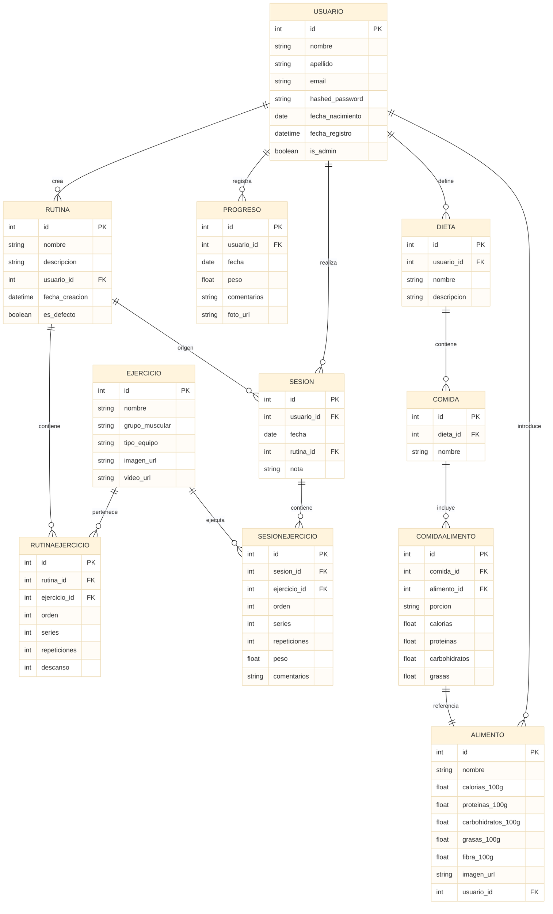

# 🏋️ Plataforma Web Fitness (TFC – Alejandro Santos)

Proyecto de fin de ciclo DAW: una aplicación web para la gestión personalizada de entrenamientos, dietas y progreso físico.

---

## 🧠 Tecnologías utilizadas

* **Frontend**: React.js + Tailwind CSS
* **Backend**: FastAPI + SQLModel + Uvicorn
* **Base de datos**: PostgreSQL (Docker)
* **Contenedores**: Docker & Docker Compose
* **Control de versiones**: Git + GitHub
* **Prototipos y diseño**: Figma
* **Despliegue**: Railway (backend) + Vercel (frontend)

---

## 📊 Funcionalidades implementadas

### 🧐 Usuario

* Registro de usuario
* Login con autenticación JWT
* Recuperación de contraseña por correo (token temporal)
* Registro automático de fecha de alta
* Actualización de perfil
* Eliminación de cuenta (solo administradores pueden eliminar cuentas ajenas)

### 💪 Ejercicios

* Ver todos los ejercicios predefinidos
* Crear ejercicios personalizados por usuario
* Filtros por grupo muscular, equipo, tipo, etc.

### 🧩 Rutinas

* Crear rutinas con nombre y descripción
* Añadir ejercicios a la rutina con orden, series, repeticiones y descanso
* Ver rutinas propias y rutinas por defecto
* Copiar rutinas por defecto a la cuenta del usuario

### 🔁 Sesiones de entrenamiento

* Iniciar sesión desde rutina (copia ejercicios)
* Registrar peso real, repeticiones efectivas, comentarios
* Consultar sesiones pasadas y ver historial

### 📈 Progreso físico

* Registrar peso corporal, comentarios y fotos
* Consultar evolución semanal o mensual

### 🥽 Consulta nutricional

* Buscar alimentos reales por nombre en la API Open Food Facts
* Mostrar nombre, marca, calorías y macros por 100g
* Mostrar imagen del alimento para verificación visual

### 🍽️ Dietas y comidas

* Crear dietas personales
* Dividirlas en comidas (desayuno, comida, cena...)
* Añadir alimentos por porción con macros personalizados
* Usar alimentos de Open Food Facts o creados por el usuario

### ✍️ Crear alimentos personalizados

* El usuario puede crear sus propios alimentos (ej: "batido postentreno")
* Introducir nombre, imagen opcional, macros por 100g
* Asociados únicamente al usuario que los crea

---

## 📆 Estructura del proyecto

```bash
web-fitness/
├── web-fitness-front/     # React + Tailwind
├── web-fitness-back/      # FastAPI + SQLModel
│   ├── app/
│   │   ├── main.py
│   │   ├── models.py
│   │   ├── routers/
│   │   │   └── usuarios.py
│   │   ├── db.py
│   │   ├── auth.py
│   │   ├── dependencies.py
│   │   ├── schemas.py
│   │   ├── validators.py
│   ├── requirements.txt
│   └── docker-compose.yml
└── entregas/              # Informes, entregables
```

---

## 🚪 Cómo ejecutar el backend

```bash
cd web-fitness-back
python -m venv venv && source venv/bin/activate  # o .\venv\Scripts\activate en Windows
pip install -r requirements.txt
docker compose up -d  # levanta PostgreSQL
uvicorn app.main:app --reload  # arranca la API
```

---

## 📌 Diagrama entidad-relación


