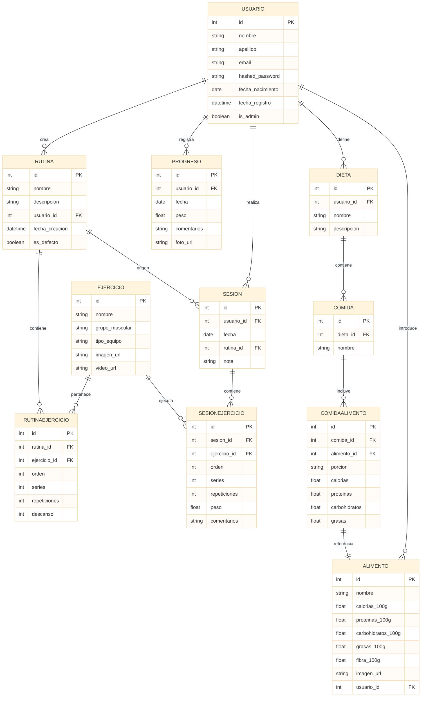

# ⚙️ Backend – Plataforma Web Fitness

Este directorio contiene todo el código backend del proyecto **TFC: Plataforma Web Fitness**, desarrollado por **Alejandro Santos Cabrera** para el ciclo **Desarrollo de Aplicaciones Web (DAW)**.

Está construido con **FastAPI + SQLModel + PostgreSQL**, e implementa una arquitectura moderna, escalable y bien documentada.

---

## 🧪 Tecnologías utilizadas

* **FastAPI** – framework web asíncrono y rápido
* **SQLModel** – ORM moderno (combinación de Pydantic + SQLAlchemy)
* **PostgreSQL** – base de datos relacional robusta (vía Docker)
* **Uvicorn** – servidor ASGI para desarrollo
* **JWT** – autenticación y autorización por token
* **Docker Compose** – entorno reproducible con contenedores
* **Pydantic** – validación de datos avanzada con `@field_validator`

---

## 📁 Estructura del proyecto

```bash
web-fitness-back/
├── README.md
├── app/
│   ├── main.py               # Punto de entrada de FastAPI
│   ├── db.py                 # Motor y sesión de base de datos
│   ├── models.py             # Modelos de datos (SQLModel)
│   ├── schemas.py            # Esquemas Pydantic para validaciones
│   ├── validators.py         # Validaciones personalizadas
│   ├── dependencies.py       # get_current_user + lógica de permisos
│   ├── auth.py               # Login, hash de contraseñas y tokens JWT
│   └── routers/
│       ├── usuarios.py       # CRUD y auth de usuarios
│       ├── ejercicios.py     # CRUD de ejercicios con control de acceso
│       └── rutinas.py        # Gestión de rutinas y ejercicios asociados
├── requirements.txt          # Dependencias del backend
└── docker-compose.yml        # Servicio PostgreSQL local
```

---

## 🔐 Gestión de Usuarios

* Registro de usuarios con validaciones personalizadas.
* Inicio de sesión con autenticación basada en JWT.
* Recuperación de contraseña mediante token temporal.
* Actualización de perfil, incluyendo validación de contraseñas seguras.
* Eliminación de cuentas, con restricciones según roles (`is_admin`).
* Listado y consulta de usuarios (solo para administradores).

---

## 💪 Gestión de Ejercicios

* Creación de ejercicios personalizados por los usuarios.
* Visualización de ejercicios públicos y propios.
* Edición y eliminación de ejercicios, con restricciones de permisos.
* Filtros por grupo muscular, tipo de equipo y otros atributos.

---

## 🧩 Gestión de Rutinas

* Creación de rutinas con nombre y descripción.
* Asociación de ejercicios a rutinas, con orden, series y repeticiones.
* Visualización de rutinas propias y rutinas por defecto.
* Edición y eliminación de rutinas, respetando permisos de usuario.
* Copia de rutinas por defecto a cuentas de usuarios.

---

## 🚀 Cómo levantar el backend localmente

```bash
cd web-fitness-back
python -m venv venv && source venv/bin/activate  # En Windows: .\venv\Scripts\activate
pip install -r requirements.txt
docker compose up -d                             # Levanta PostgreSQL en localhost:5432
uvicorn app.main:app --reload                    # Levanta el servidor en http://localhost:8000
```

## 📌 Diagrama entidad-relación



## 🚧 Módulos pendientes

* Registro de sesiones de entrenamiento (`Sesion`, `SesionEjercicio`).
* Seguimiento físico con progreso y fotos (`Progreso`).
* Gestión de alimentos y dietas (`Dieta`, `Comida`, `Alimento`).
* Integración con API externa para búsqueda de alimentos (OpenFoodFacts).
* Tests automatizados con `pytest`.
* Despliegue completo en Railway.

---

## 👤 Autor

**Alejandro Santos Cabrera**  
TFC – Desarrollo de Aplicaciones Web (DAW)  
Backend desarrollado con **FastAPI** y **PostgreSQL**
